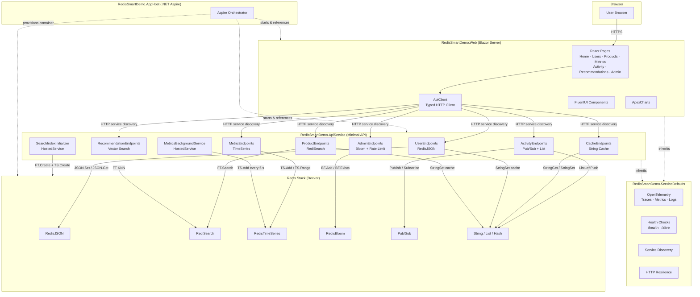
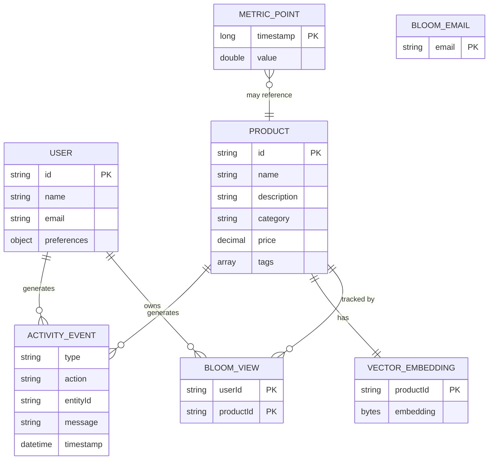
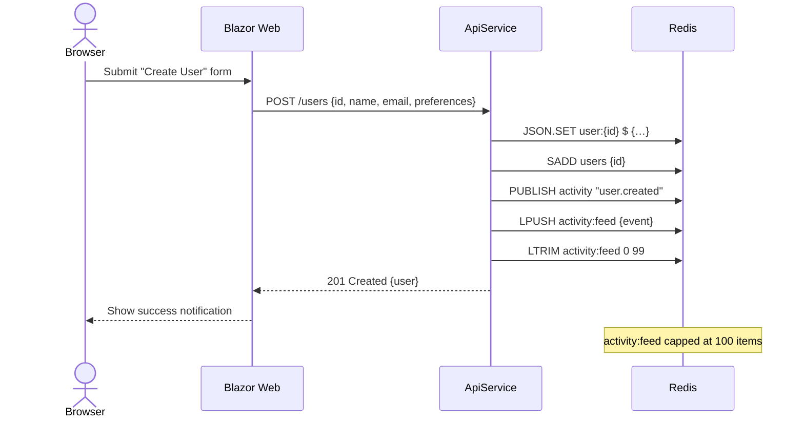
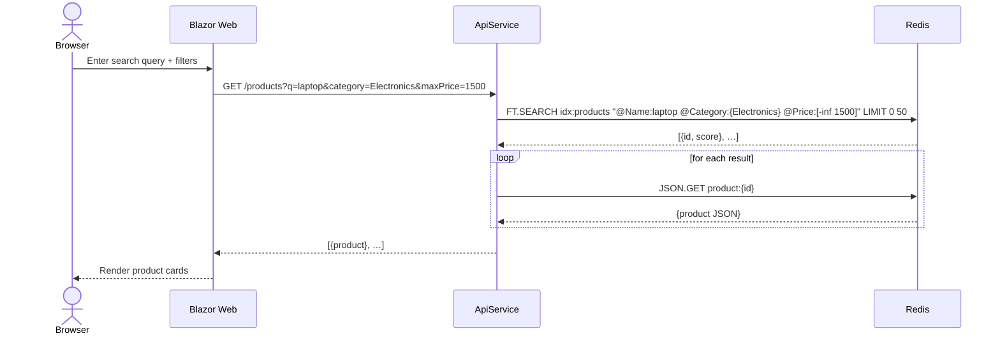
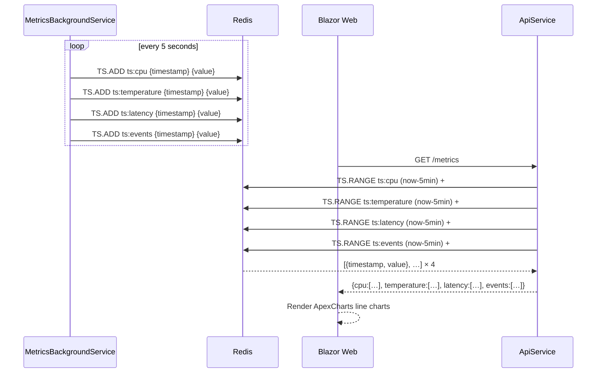
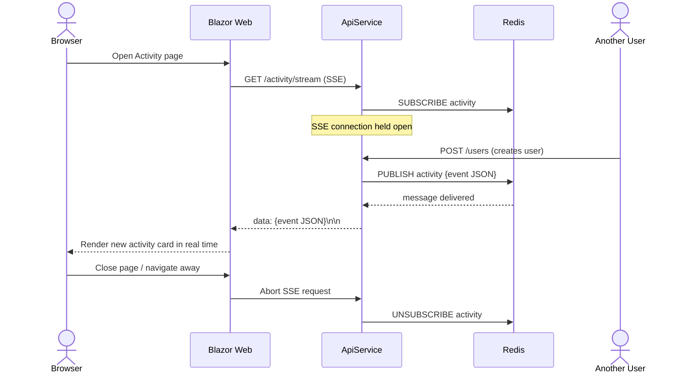
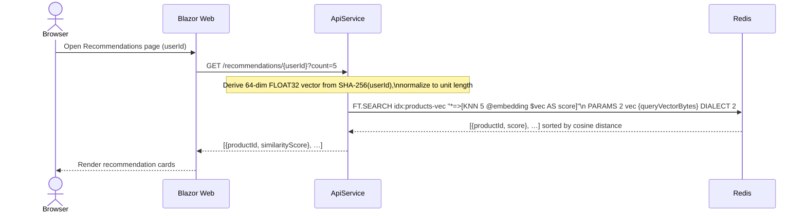
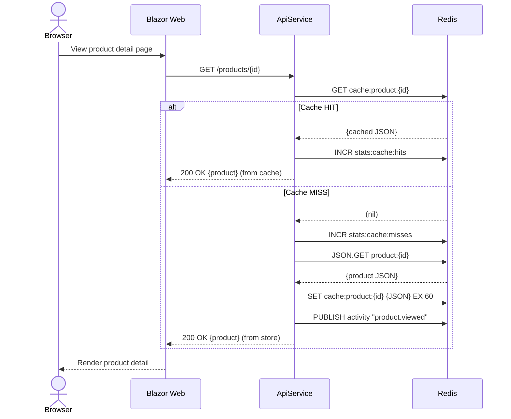
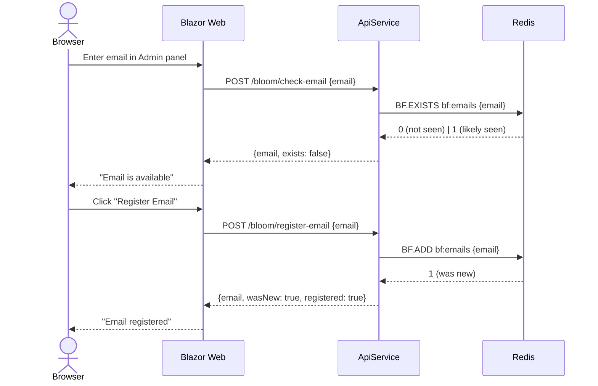
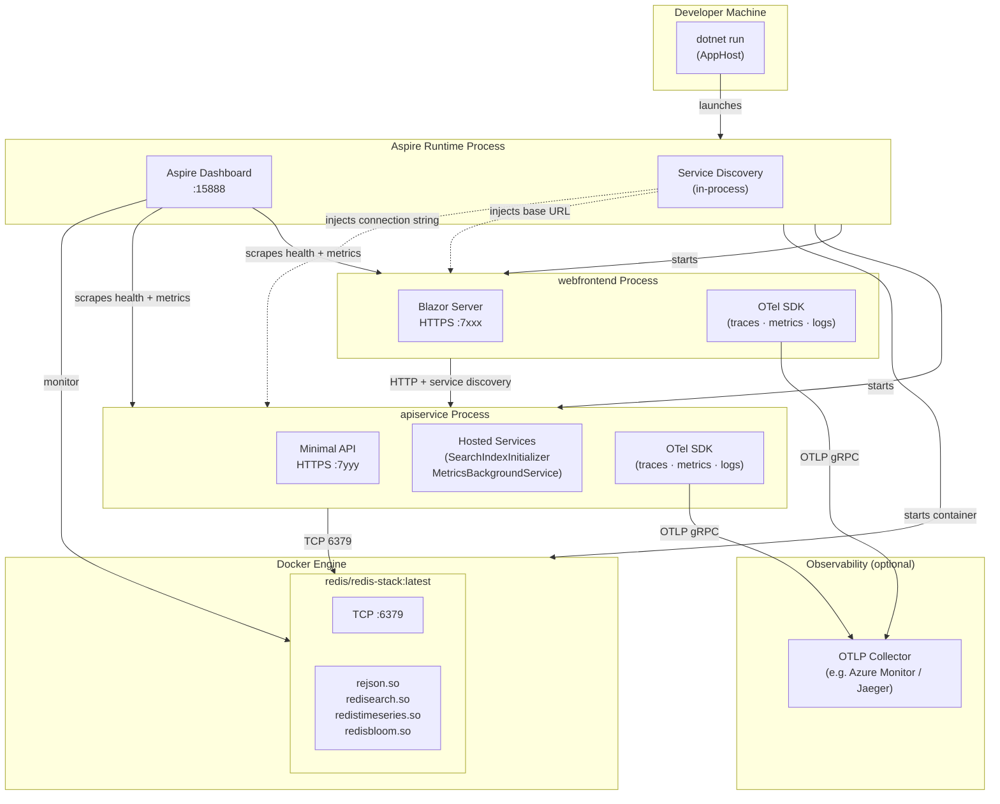

# Software Design Document  
## Redis Smart Dashboard

**Version:** 1.0  
**Date:** April 14, 2026  
**Stack:** .NET 10 · .NET Aspire · Blazor Server · ASP.NET Core Minimal API · Redis Stack

---

## Table of Contents

1. [Overview](#1-overview)
2. [Goals & Scope](#2-goals--scope)
3. [System Architecture Diagram](#3-system-architecture-diagram)
4. [Component Descriptions](#4-component-descriptions)
5. [Redis Data Architecture](#5-redis-data-architecture)
6. [API Design](#6-api-design)
7. [Sequence Diagrams](#7-sequence-diagrams)
8. [Infrastructure Diagram](#8-infrastructure-diagram)
9. [Observability](#9-observability)
10. [Security Considerations](#10-security-considerations)
11. [Non-Functional Requirements](#11-non-functional-requirements)

---

## 1. Overview

Redis Smart Dashboard is a reference application that demonstrates seven distinct Redis Stack capabilities within a single, cohesive .NET Aspire solution. The system is composed of a Blazor Server frontend, a RESTful Minimal API backend, and a Redis Stack container managed by the Aspire orchestrator.

---

## 2. Goals & Scope

| Goal | Description |
|---|---|
| Demonstrate Redis breadth | Show JSON, Search, TimeSeries, Pub/Sub, Vector, Bloom, and caching in one app |
| Developer experience | Single `dotnet run` to bring up the full stack via Aspire |
| Observable by default | OpenTelemetry traces, metrics, and logs wired at the framework level |
| Minimal external dependencies | Only Docker is required beyond .NET |

**Out of scope:** authentication/authorization, multi-node Redis cluster, persistent volumes, production hardening.

---

## 3. System Architecture Diagram



---

## 4. Component Descriptions

### 4.1 RedisSmartDemo.AppHost

The Aspire orchestration host. Responsibilities:

- Pulls `redis/redis-stack:latest` and starts the container with all Redis modules loaded (`rejson`, `redisearch`, `redistimeseries`, `redisbloom`).
- Registers `apiservice` and `webfrontend` projects as Aspire resources.
- Injects the Redis connection string into `apiservice` via `WithReference(redis)`.
- Enforces startup ordering: Redis → ApiService → WebFrontend.
- Configures external HTTP endpoints and health check probes.

### 4.2 RedisSmartDemo.ApiService

Minimal API backend with seven feature groups:

| Endpoint Class | Redis Feature | Key Operations |
|---|---|---|
| `UserEndpoints` | RedisJSON | `JSON.SET`, `JSON.GET`, cache-aside read |
| `ProductEndpoints` | RediSearch | `FT.SEARCH` with full-text, tag, and numeric filters |
| `MetricEndpoints` | RedisTimeSeries | `TS.ADD`, `TS.RANGE` |
| `ActivityEndpoints` | Pub/Sub + List | `PUBLISH`, `SUBSCRIBE`, `LPUSH`, `LRANGE` |
| `RecommendationEndpoints` | Vector Search | `FT.SEARCH` KNN with HNSW index |
| `AdminEndpoints` | Bloom Filter | `BF.ADD`, `BF.EXISTS`, sliding-window rate limiter |
| `CacheEndpoints` | String | `GET`/`SET` with TTL, bulk eviction, hit-rate stats |

Two hosted services run on startup:

- **`SearchIndexInitializer`** — creates `idx:products` (FT JSON index), `idx:products-vec` (HNSW vector index), and four TimeSeries keys, idempotently.
- **`MetricsBackgroundService`** — writes simulated `cpu`, `temperature`, `latency`, and `events` data points every 5 seconds.

### 4.3 RedisSmartDemo.Web

Blazor Server application providing an interactive dashboard. Nine pages map to the same feature areas as the API. Uses `ApiClient` (typed `HttpClient`) for all API calls. UI is built with Microsoft Fluent UI components; charts use `Blazor-ApexCharts`.

### 4.4 RedisSmartDemo.ServiceDefaults

Shared extension methods applied to both `ApiService` and `Web`:

- OpenTelemetry (traces, metrics, logs) with optional OTLP export.
- HTTP resilience via `AddStandardResilienceHandler`.
- Service discovery via `AddServiceDiscovery`.
- `/health` and `/alive` endpoints (development only).

---

## 5. Redis Data Architecture



**Redis key space summary:**

```
user:{id}                  → JSON  (User document)
users                      → Set   (all user IDs)
product:{id}               → JSON  (Product document)
products                   → Set   (all product IDs)
cache:user:{id}            → String, TTL 60 s
cache:product:{id}         → String, TTL 60 s
stats:cache:hits           → String (counter)
stats:cache:misses         → String (counter)
activity:feed              → List  (capped at 100)
ts:cpu                     → TimeSeries, 24 h retention
ts:temperature             → TimeSeries, 24 h retention
ts:latency                 → TimeSeries, 24 h retention
ts:events                  → TimeSeries, 24 h retention
vec:product:{id}           → Hash  (64-dim FLOAT32 embedding)
bf:emails                  → Bloom Filter
bf:seen:{userId}           → Bloom Filter (per-user)
ratelimit:{userId}:{min}   → String (counter, TTL 1 min)
idx:products               → FT Index (JSON, prefix product:)
idx:products-vec           → FT Index (Hash, prefix vec:product:)
```

---

## 6. API Design

All endpoints follow REST conventions and return `application/json`. Error responses use `ProblemDetails` (RFC 7807). Interactive documentation is available at `/scalar` in development.

### Cache-Aside Pattern (Users & Products)

```
GET /users/{id}
  → check cache:user:{id}
    HIT  → inc stats:cache:hits  → return cached JSON
    MISS → inc stats:cache:misses
         → JSON.GET user:{id}
         → SET cache:user:{id} EX 60
         → return JSON
```

### Vector Embedding Strategy

Embeddings are SHA-256 derived, normalised to unit length, and stored as 64-dimensional `FLOAT32` vectors. In production this would be replaced with a real embedding model (e.g., Azure OpenAI `text-embedding-ada-002`).

### Rate Limiting

Sliding-window rate limiter using a per-minute counter key:

```
key = ratelimit:{userId}:{yyyyMMddHHmm}
INCR key  →  if count == 1 → EXPIRE key 60
return { used, remaining, isLimited }
```

---

## 7. Sequence Diagrams

### 7.1 User Creation (RedisJSON + Pub/Sub)



### 7.2 Product Search (RediSearch)



### 7.3 Metrics Recording & Retrieval (RedisTimeSeries)



### 7.4 Activity Stream (Pub/Sub + SSE)



### 7.5 Product Recommendation (Vector KNN)



### 7.6 Cache-Aside Read (User/Product)



### 7.7 Bloom Filter — Email Registration



---

## 8. Infrastructure Diagram



### Infrastructure Notes

| Concern | Decision |
|---|---|
| Container image | `redis/redis-stack:latest` — all modules pre-built |
| Module loading | Passed as `--loadmodule` args by Aspire `WithArgs()` |
| Networking | Aspire manages loopback ports; no manual port mapping required |
| Health probes | `/health` on both services; Aspire polls before allowing dependent starts |
| Startup ordering | Redis → ApiService (WaitFor) → WebFrontend (WaitFor) |
| OTLP export | Enabled when `OTEL_EXPORTER_OTLP_ENDPOINT` env var is set |
| Persistence | None (demo); all data lost on container restart |

---

## 9. Observability

| Signal | Source | Filters |
|---|---|---|
| **Traces** | ASP.NET Core + HttpClient | `/health` and `/alive` paths excluded |
| **Metrics** | ASP.NET Core + HttpClient + .NET Runtime | — |
| **Logs** | All services | Structured with scopes and formatted messages |

All telemetry is exported via OpenTelemetry OTLP if `OTEL_EXPORTER_OTLP_ENDPOINT` is set. The Aspire dashboard provides built-in trace and log viewers without any external tooling.

---

## 10. Security Considerations

| Risk | Mitigation |
|---|---|
| Redis exposed on loopback only | Aspire binds Redis to `127.0.0.1`; not accessible externally in dev |
| No authentication on API | Acceptable for demo; production must add bearer token or API key auth |
| Rate limiter bypass | Per-minute counter is advisory only; production would use middleware |
| Bloom filter false positives | Bloom filters may produce false positives; critical checks should fall back to authoritative store |
| Embedding determinism | SHA-256 embeddings are deterministic but not semantically meaningful; replace with real model in production |

---

## 11. Non-Functional Requirements

| Requirement | Target |
|---|---|
| Startup time | Full stack ready in < 30 seconds on developer hardware |
| Metrics flush interval | 5 seconds (configurable via background service delay) |
| Cache TTL | 60 seconds for user and product caches |
| TimeSeries retention | 24 hours (86 400 000 ms) per metric key |
| Activity feed depth | Last 100 events (LTRIM enforced on every push) |
| Rate limit window | 10 requests per user per minute |
| Vector dimension | 64 FLOAT32 values per product embedding |
| Search result page size | Up to 50 products per query |
